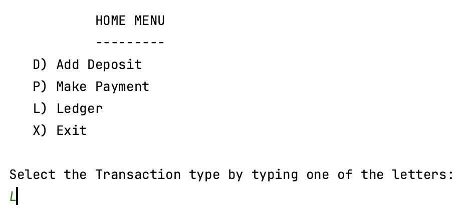
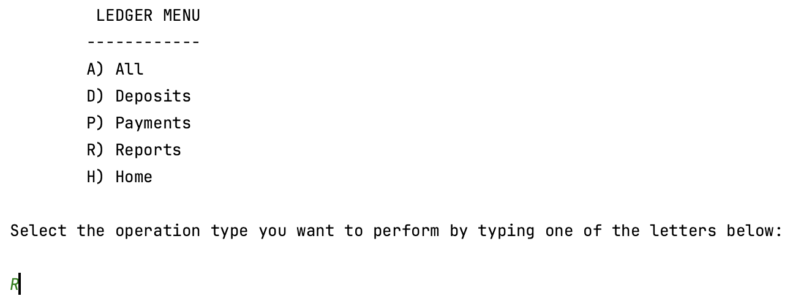
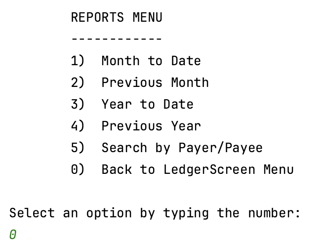

# Accounting Ledger App
**Author: TYSON HALL**

The Accounting Ledger App is a Java command-line interface (CLI) application designed to help you efficiently manage and keep track of your financial transactions. It allows you to record deposits and payments, view a ledger of all your financial activities, and run various financial reports.

## Features

- **Add Deposit**: Record and save deposit information, including the date, time, description, vendor, and amount.

- **Make Payment**: Record and save payment information, including the date, time, description, vendor, and amount.

- **Ledger**: View a detailed ledger of all your financial transactions. Entries are automatically sorted to show the newest transactions first.

- **Reports**: Generate various financial reports, such as Month to Date, Previous Month, Year to Date, Previous Year, and the ability to search by vendor.

- **Exit**: Safely exit the application when you're done.

## Getting Started

1. Clone or download this repository to your local machine.

2. Compile the Java code using your preferred Java development environment.

3. Run the application in the command line.

## Usage

- When you run the application, you'll be presented with a user-friendly menu where you can choose to add deposits, make payments, view your ledger, generate reports, or exit the application.

- The ledger entries are automatically sorted by date in descending order, showing the newest transactions first, making it easy to stay up-to-date with your financial activities.

## User Command Line Interface (CLI)

- **Home Screen**: 

- **Ledger Screen**:

- **Reports Screen**:

